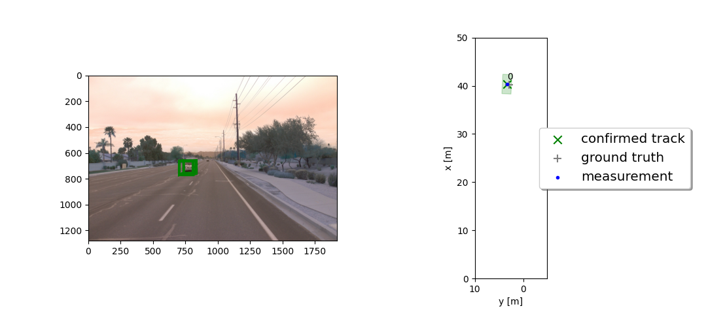
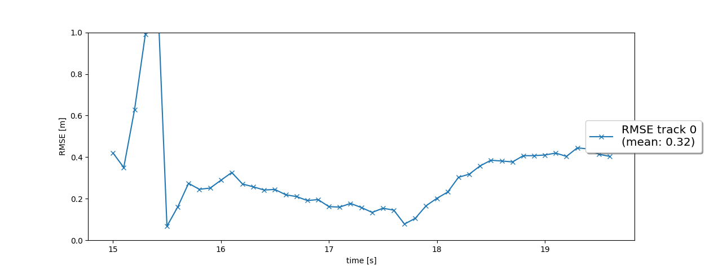
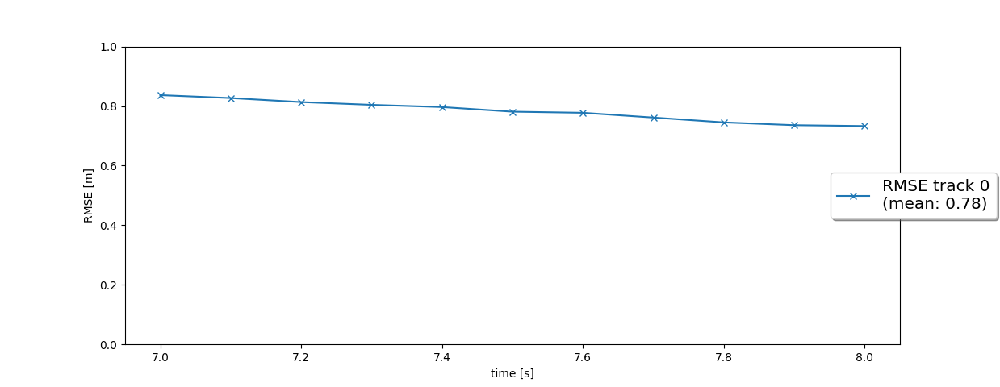
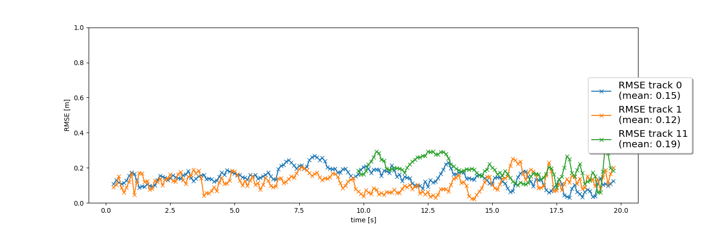
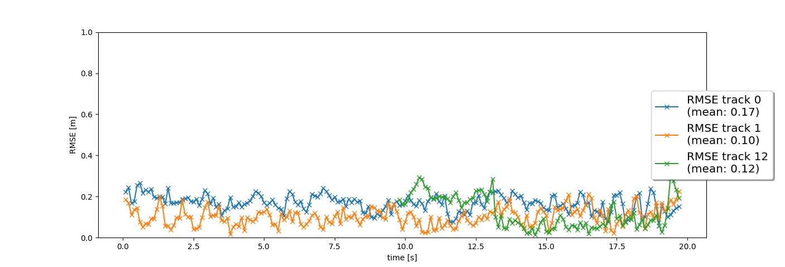

# Writeup: Track 3D-Objects Over Time

# 1. Write a short recap of the four tracking steps and what you implemented there (filter, track management, association, camera fusion). Which results did you achieve? Which part of the project was most difficult for you to complete, and why?

## Step 1 Implement an EKF to track a single real-world target with lidar measurement input over time!

### The results of /student/filter.py are shown as follows. The mean RMSE is 0.32.

## Step 2 Implement the track management to initialize and delete tracks, set a track state and a track score.

### The results of student/trackmanagement.py are shown as follows. 
<video src="img/step2.mp4" controls="controls" style="max-width: 730px;">
</video>
The mean RMSE is 0.78.

## Step 3 Implement a single nearest neighbor data association to associate measurements to tracks. You will finally move on to multi target tracking now!

### The results of student/trackmanagement.py are shown as follows. 
<video src="img/step3.mp4" controls="controls" style="max-width: 730px;">
</video>

## Step 4 Implement the nonlinear camera measurement model. You will finally complete the sensor fusion module for camera-lidar fusion!
### The final results are shown as follows. 
<video src="img/step4.mp4" controls="controls" style="max-width: 730px;">
</video>

Two of the tracks (track 0 and track 1) are able to be tracked from beginning to end of the sequence (0s - 200s) without track loss. The mean RMSE for these two tracks are below 0.2. No confirmed ghost tracks or track losses occur.

# 2. Do you see any benefits in camera-lidar fusion compared to lidar-only tracking (in theory and in your concrete results)? 
In theory, there are lots of benefits in camera-lidar fusion compared to lidar-only trcking.Lidar can directly measure distance and velocity. Meanwhile, camera contains much richer features and can be used for more accurate object detection and segmentation than lidar. 
In my concrete results, the result of camera-lidar fusion result (step 4) is much better than the lidar-only result (step 2). RMSE score for step 4 is below 0.2. For lidar-only result, RMSE is about 0.8.

# 3. Which challenges will a sensor fusion system face in real-life scenarios? Did you see any of these challenges in the project?
The first challenges for sensor fusion in real-life scenarios is data association and time synchronization. Different sensor might be generated in different frame rate and might be from different operation system. It is hard to accurate associate different sensor data for a given time. Secondly, It is difficult to have a general and simple rule for dealing with data conflicts. Objects may be only detected by one sensor and not be reported by other sensors.

# 4. Can you think of ways to improve your tracking results in the future?

In this project, we are using traditional algorithms with a lot of hand engineering, like extended kalman filter. I think deep learning approaches may be more powerful for pose estimation and scene understanding.